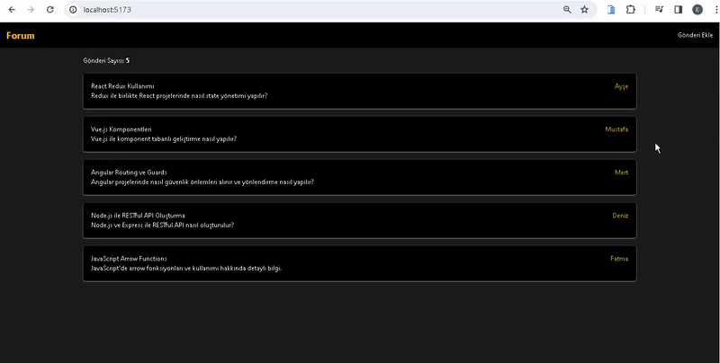

<h1> Forum App </h1>

I've independently designed and coded a responsive Forum app, and it's ready to explore!

🔸 Project Name: [Forum app]

🔸 Technologies Used: React, axios, json-server, react-router-dom, tailwind

🔸 Project Description: This website, which I designed and coded from scratch, works flawlessly on various devices, from mobile phones to desktop computers. In this project, I implemented a forum platform that allows users to create and publish posts using MVC architecture.

# Libraries

- axios
- json-server
- react-router-dom
- tailwind

MVC (Model - View - Controller)

<h2>Screen_Shoot</h2>

